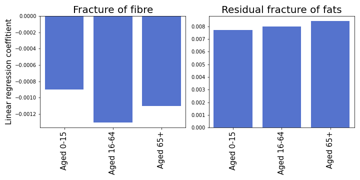

## You are what you eat

You are what you eat - an idiom surely most of us have already heard at some point in our life. Be it as a child when we did not want to eat the broccoli our mother lovingly prepared, or from your colleague at work who just discovered veganism.
This idiom simply states that "the food one eats has a bearing on one's state of mind and health." [[1]](https://www.phrases.org.uk/meanings/you-are-what-you-eat.html)
Very few would argue this, however, we want to take this idiom literally: are you really what you eat?

This question immediately leads to another question: what are you exactly?
We do not want to make this question any more philosophical than it already is, therefore, we assume that groups of people can be defined by their external properties: age, religion, ethnicity, wealth, and so on.
There certainly exist multiple ways of defining a person, however, the aforementioned values can easily be captured by population demographics, and thus, are of interest to us.

## Our Goal

We are interested in the influence of demographic data on food composition.
Can food consumption habits be mapped to certain groups of people?
In this data story, we are going to answer this question in two parts: first, we will explore relations between each demographic marker and food consumption habits.
Afterward, we will investigate how well we can predict food consumption habits from demographic markers.
These analyses are interesting, but not useful without a specific use-case.
Therefore, we are going to apply our newly-gained understanding and develop a marketing strategy for a new protein bar!

## Introducing the Data Sets

In this data story, we explore the relationship between food consumption habits and population demographics in the year 2015 in London.
For our analyses, we use two data sets: the [Tesco 1.0 Grocery](https://www.nature.com/articles/s41597-020-0397-7) data set and the [ward profiles](https://data.london.gov.uk/dataset/ward-profiles-and-atlas) published in 2015 by the government of the United Kingdom.
The Tesco data set captures provides an aggregated view of food purchases for the year 2014 in Tesco supermarkets in London.
For every ward, it contains the nutrient content of the typical food product - in other words, all purchased products of 2014 are aggregated to yield the "average" food product of a ward.
The average food product is then given by the energy content of each individual nutrient - i.e. carbohydrates, protein, fibre, alcohol, and fats.

 
	
	
Nutrients of the average food product in the ward "Gascoigne". Looks yummy, doesn't it?

The ward profiles provide a range of demographic data, such as population age distribution, ethnicities, general fertility rate, ambulance callouts, and many more for 625 wards.
The ward profiles provide 1000 features! We, therefore, limit our analyses to the following features: *age distribution*, *ethnicity*, *religion*, *qualification*, *household income*, *happiness*, *Health*, and *Happiness*. 
However, one problem arises: most of these indicators were either collected in 2013, or with the nationwide census of 2011.
The Tesco data set contains grocery data from 2014, that's a 1- or 3-year difference!
Does that make a difference?

## Did the population demographics change between 2011 and 2014?

Before we can start exploring the relationship between food and demographics, we need to first investigate how the time of the survey influences the demographics.
To do this, we calculate the change in population for 2011 and 2013 in relation to 2014 for every ward.

 
	
	
Relative population difference of all wards between 2011/2014 and 2013/2014.

The difference in population of wards for 2014 and 2013 is small, only 11 wards show more than a 5% change in population count.
However, 111 wards show a difference larger than 5% for 2011.
With this, we conclude that the population in those 111 wards changed significantly.
This population change might also influence other demographic factors.
Therefore, we exclude these wards for the following analyses.
The remaining wards do not seem to have changed much in terms of population numbers.
Thus, we assume that other demographic markers did not significantly change as well.
This leaves us in total with 506 wards in the data set.

## Teenagers love Carbs

To get a first glimpse at the interactions between the demographics and the nutrients, we merge boith data sets and visualize each marker against each nutrient.

 
<iframe  width="900" height="800" frameborder="0" scrolling="no" src="assets/plots/demo_vs_nutrients.html">
</iframe>

Contour plot of nutrients vs. demographics. The x-axis denotes the energy content of the selected nutrient in the average food product, the y-axis shows the selected demographic marker.

Looking at the contour plot, we can see some interesting correlations.
Interestingly, the amount of carbohydrates consumed in a ward seems to be positively correlated with the number of people with lower qualifications and with younger people under the age of 15.
Furthermore, wealthier wards (indicated by a higher median and mean household income) seem to consume more protein, wards with more non-religious people seem to consume more alcohol.
These findings are quite interesting, thus, we want to explore these correlations further.

## Correlating Demographics and Food Habits

The qualitative analysis is interesting, but as Data Scientists, we love numbers and hard facts.
Thus, we calculate the Spearman Rank coefficient between the nutrients and the demographic markers and their corresponding p-values, to estimate whether the correlations are actually significant.

 
	
	
Spearman Rank correlations of demographic markers vs. nutrients (left) and their corresponding p-
	values (right). Significant p-values are indicated with blue.

Judging by the p-values, most correlations are significant.
`Well-Being` is not a demographic marker showing significant correlations with nutrients, a similar conclusion can be made for `Aged 65+` and `Born in UK`.
The prevalence of `White` is positively correlated with the energy provided by protein, alcohol, and fibre.
Wards with less religious people (indicated by a higher fraction of `No religion`) seem to consume more alcohol, more fibre, and more protein.
All in all, the nutrients show many significant correlations with demographic markers.
However, it is difficult to judge which demographic markers can actually best predict each nutrient.
To find the most important demographic markers, we build a prediction model for each nutrient using the demographics as independent variables.

## Searching for the most important features

If we want to extract the interesting food habits of different demographic groups we need to look for those features that make the highest impact and analyze relations between them.
One of the common ways to do so is to train linear regression and evaluate the regression coefficients for statistical significance.
Here, we are going to build a model for each nutrient and use the demographics as independent variables.
Analysis of the significance of each regression coefficient will give us insights on what features have the highest impact on consumption rates of the nutrient predicted, along with knowledge of whether this feature increases the nutrient use or decreases it.
However, to obtain credible results, we first need to analyze which nutrients can be predicted reliably by demographics.

## Which nutrients can be reliably predicted?

We want our linear regressions to extract general dependencies between features and labels, however, given such a small relative number of rows (~500 wards) in the dataset, there can be troubles solving this problem. 
We can end up with cases where the performance of the model is dependent on the training set, i.e. the model extracts relations that are of a high value for this specific train dataset.
It is needless to say that an overfitted model that is highly dependent on a random training dataset is not something we are eager to obtain.

Therefore, we want to find the nutrients which can be reliably predicted with our demographics.
To do this, we train 1000 linear regression models for each nutrient on random training/test splits and evaluate the confidence intervals of the R^2 score on the corresponding test set.
We determine a nutrient to be reliable if its R^2 95% confidence interval covers a range of R^2 values less than 1/4.
In other words, a nutrient is reliable if the R^2 varies less than 1/4 between the training/test splits.

|         		| R^2   | low CI| high CI - low CI|
|:----------------------|:------|:------|:----------------|
| Total energy 		| 0.65	| 0.51  | 0.25            |
| Carbs           	| 0.76	| 0.67  | 0.16            |
| Fraction of carbs     | 0.71	| 0.6   | 0.18            |
| Fraction of protein   | 0.68	| 0.56  | 0.22            |
| Fraction of fibres    | 0.76	| 0.66	| 0.17            |

The table above shows the models we are left with after the filtering: total energy, carbs, fraction of carbs, fraction of proteins, and fraction of fibres.

## What about fats?

The attentive reader might notice that the nutrient *fat* is missing from the previous table, the corresponding is not reliable.
Does that mean we cannot predict fat reliably?
Luckily, we have all the fractions of nutrients and the total energy.
Given the fact that the fractions of carbs, protein, fiber, and fats sum up to 1 by the definition, we can obtain a reliable model for fats by considering fats to be the residual left from all the other fractions.
In other words, we obtain a prediction for fats by subtracting all other nutrients fractions from 1. 
To do this, we train a model to predict this residual fraction and consider the coefficients of this model.
Moreover, we can get absolute values of nutrients, since we also have a reliable model for the total energy.
Good news! 
We now know that we can build models to predict the average food product!
We proceed with the following models: fraction of carbs, fraction of proteins, fraction of fibres, total energy, and fraction of residual fats.

## Predicting the Nutrients

To find the most important demographic markers, we proceed in the following way: for each nutrient, we fit a linear regression.
We deem a demographic marker to be significant if the p-value of the corresponding regression coefficient is smaller than 0.05.

## An Overview of all Results

 
	
	
Significant coefficients of linear regression predicting nutrient consumption rates 
from demographic features.

Looks quite complex, right? Let's take a look at selected demographic markers.

## Age Predicts Fats and Fibres

 
	
	
 Significant Linear regression coefficients that refer to age

We see that consumption rates of fibers and fats are governed mostly by age.
Adult people consume less fiber than others.
With age, the fraction of consumed fats grows.

## Ethnicities and Nutrients

 
	
	
 Significant Linear regression coefficients that refer to ethnicities.

The presence of Asians drastically increases the consumption of carbohydrates, which could be explained by a traditional preference for grains such as rice.
At the same time, the negative coefficient for proteins and the positive one for fats tell us that Asians prefer carb and fat rich meals with less protein.
And indeed, one of our team members spent 3 months in China.
He noticed too, that the Chinese kitchen is rich in fat and carbs, which reinforces our findings.
Comparing these results to preferences of black people we see opposite results.
The presence of Black people drastically decreases the consumption of fats and increases protein consumption.
The presence of White people, in turn, decreases carb consumption and increases protein and fibre consumption.

## Vegetarian Diets Increase Fibre Consumption

 
	
	
 Significant Linear regression coefficients that refer to religions.

Some religions strongly affect the diet.
Buddhists, Hindu, and Sikhs are vegetarian, Jewish consider most of the plant-based food kosher.
All this can be seen by the drastic increase in fiber consumption.
Hindu and Sikh exclude fats from their diet, which can also be seen in the large negative coefficient.
Generally, a larger fraction of religious people increase protein consumption, while non-religious people seem to consume less protein.
All the other demographic groups have an impact that is not very useful for logical comparison.

## Applying our models: a case study

It's the year 2030.
Meet John, he is an entrepreneur who has just opened a new grocery store in one of London's wards and now he has to fill it with products to sell.
Since John lives in a capitalist society he is eager to get the most revenue out of the shop.
So he wants to buy exactly those types and amounts of products that would satisfy the ward's residents' appetite, though he doesn't want to buy any excess products that have to be thrown away.

John is not good with statistics, so he asks you to help him make money by answering two questions: what products should he buy, and how much?

He used the Tesco 1.0 data set to get an idea of the typical food for his ward, but the data set is from 2014!
However, he has access to official demographic data for 2030 which is provided by the UK government.
He can use our model to predict the distribution of nutrients and total energy of a typical product for his ward, given the demographical data of the ward's residents. Let's help him!

Most of the dependencies between nutrients and demographics are sensibly predicted to be linear, however, some relations appear to be better described by nonlinear models.
The previous linear models were trained to get coefficients for significant features.
To get the best possible prediction for each nutrient we use a gradient boost regression.
For every nutrient, we trained linear regression and several gradients boosting regression with different hyperparameters.
We used only reliable models, as in the analysis of the coefficients.
Then we compared R^2 scores and test datasets to chose the best ones and unite them into one big model that predicts all the parameters of the typical product.

| R^2 score		|  Total energy | Fracture of protein	| Fracture of carbs 	| Fracture of fibers	|
|:----------------------|:--------------|:----------------------|:----------------------|:----------------------|
| Linear Regression 	| 0.57		| 0.71  		| 0.66            	| 0.77			|
| Gradient Boosting	| 0.62		| 0.69  		| 0.69            	| 0.7			|

Let's choose optimal models for every nutrient and like in the chapter Supplementing the dataset use it to predict residual fats.

| R^2 score		|  Total energy | Fracture of protein	| Fracture of carbs 	| Fracture of fibers	| Residual fracture of fats	|
|:----------------------|:--------------|:----------------------|:----------------------|:----------------------|:------------------------------|
| Optimal model 	| 0.62		| 0.71  		| 0.69            	| 0.77			| 0.86				|

With this model we can predict all the main constituents of a typical product and its total energy, so we have found the answers to John's questions.

 

