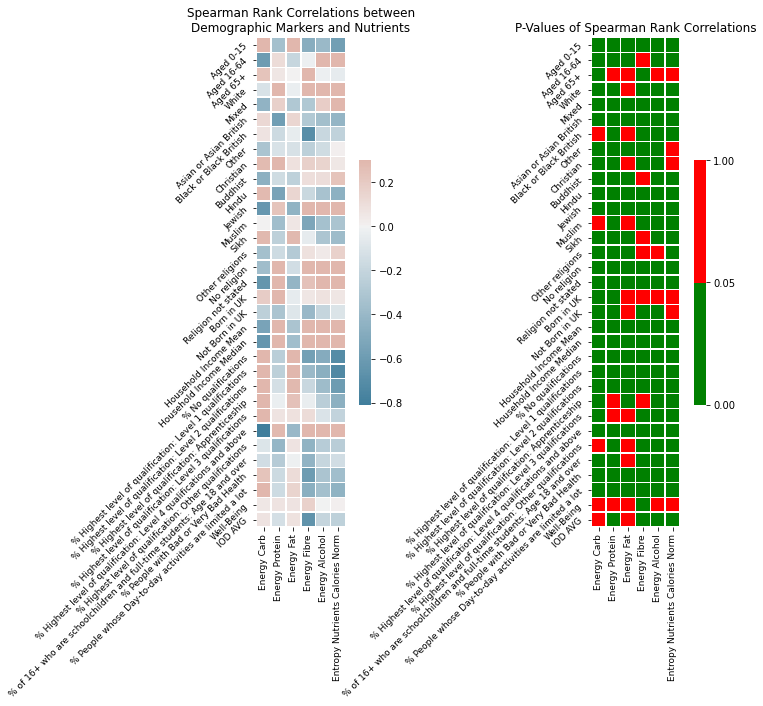

## You are what you eat ...

You are what you eat - an idiom surely most of us have already heard at some point in our life. Be it as a child when we did not want to eat the broccoli our mother lovingly prepared, or from your colleague at work who just discovered veganism.
This idiom simply states that "the food one eats has a bearing one one's state of mind and health." [[1]](https://www.phrases.org.uk/meanings/you-are-what-you-eat.html)
Very few would argue this, however, we want to take this idiom literally: are you really what you eat?

This question immediately leads to another question: what are you exactly?
We do not want to make this question any more phylosophical than it already is, therefore, we assume that groups of people can be defined by their external properties: age, religion, ethnicity, wealth, and so on.
There certainly exist multiple ways of defining a person, however, the aforementioned values can easily be captured by population demographics, and thus, are of interest for us.

## Our Goal

We are interested in the influence of demographic data on food composition.
Can food consumption habits be mapped to certain groups of people?
In this data story, we are going to answer this question in two parts: first, we will explore relations between each individual demographic marker and food consumption habits.
Afterward, we will investigate how well we can predict food consumption habits from demographic markers.
These analyses are interesting, but not really useful without a specific usecase.
Therefore, we are going to apply our newly-gained understanding and develop a marketing strategy for a new protein bar!

## Introducing the Data Sets

In this data story we explore the relation between food consumption habits and population demographics in the year 2015 in London.
For our analyses we use two data sets: the [Tesco 1.0 Grocery](https://www.nature.com/articles/s41597-020-0397-7) data set and the [ward profiles](https://data.london.gov.uk/dataset/ward-profiles-and-atlas) published in 2015 by the government of the United Kingdom.
The Tesco data set captures provides an aggregated view of food purchases for the year 2014 in Tesco supermarkets in London.
For every ward, it contains the nutrient content of the typical food product - in other words, all purchased products of 2014 are aggregated to yield the "average" food product of a ward.
The average food product is then given by the energy content of each individual nutrient - i.e. carbohydrates, protein, fibre, alcohol, and fats.

 
	
	
Nutrients of the average food product in the ward "Gascoigne". Looks yummy, doesn't it?

The ward profiles provide a range of demographic data, such as population age distribution, ethnicities, general fertility rate, ambulance callouts and many more for 625 wards.
The ward profiles provide 1000 features! We therefore limit our analyses to the following features: *age distribution*, *ethnicity*, *religion*, *qualification*, *household income*, *happiness*, *Health*, and *Happiness*. 
However, one problem arises: most of these indicators were either collected in 2013, or with the nationwide census of 2011.
The tesco data set contains grocery data from 2014, that's a 1- or 3-year difference!
Does that make a difference?

## Did the population demographics change between 2011 and 2014?

Before we can start exploring the relation between food and demographcis, we need to first investigate how the time of survey influences the demographics.
To do this, we calculate the change in population for 2011 and 2013 in relation to 2014 for every ward.

 
	
	
Relative population difference of all wards between 2011/2014 and 2013/2014.

The difference in population of wards for 2014 and 2013 is small, only 11 wards show more than a 5% change in population count.
However, 111 wards show a difference larger than 5% for 2011.
With this, we conclude that the population in those 111 wards changed significantly.
This change in population might also influence other demographic factors.
Therefore, we exclude these wards for the following analyses.
The remaining wards do not seem to have changed much in terms of population numbers.
Thus, we assume that other demographic markers did not significantly change as well.
This leaves us in total with 506 wards in the data set.

## Teenagers love Carbs

To get a first glimpse at the interactions between the demographics and the nutrients, we merge boith data sets and visualize each marker against each nutrient.

 
<iframe  width="900" height="800" frameborder="0" scrolling="no" src="assets/plots/demo_vs_nutrients.html">
</iframe>

Contour plot of nutrients vs. demographics. The x-axis denotes the energy content of the selected nutrient in the average food product, the y-axis shows the selected demographic marker.

Looking at the contour plot, we can see some interesting correlations.
Interestingly, the amount of carbohydrates consumed in a ward seems to be positively correlated with the number of people with lower qualifications and with younger people under the age of 15.
Furthermore, wealthier wards (indicated by a higher median and mean household income) seem to consume more protein, wards with more non-religious people seem to consume more alcohol.
These findings are quite interesting, thus, we want to explore these correrlations further.

## Correlating Demographics and Food Habits

The qualitative analysis is interesting, but as Data Scientists, we love numbers and hard facts.
Thus, we calculate the Spearman Rank coefficient between the nutrients and the demographic markers and their corresponding p-values, to estimate whether the correlations are actually significant.

 
	
	
Spearman Rank correlations of demographic markers vs. nutrients (left) and their corresponding p-
	values (right). Significant p-values are indicated with blue.

Judging by the p-values, most correlations are significant.
`Well-Being` is not a demographic marker showing significant correlations with nutrients, a similar conclusion can be made for `Aged 65+` and `Born in UK`.
The prevalence of `White` is positively correlated with the energy provided by protein, alcohol and fibre.
Wards with less religious people (indicated by a higher fraction of `No religion`) seem to consume more alcohol, more fibre and more protein.
All in all, the nutrients show many significant correlations with demographic markers.
However, it is difficult to judge which demographic markers can actually best predict each nutrient.
To find the most important demographic markers, we build a prediction model for each nutrient using the demographics as independent variables.

## Searching for the most important features

If we want to extract the interesting food habits of different demographic groups we need to look for those features that make the highest impact and analyze relations between them. One of the common ways to do so is to train linear regression to predict a given nutrient based on demographic features. Consideration of linear regression coefficients will give us insights on what features make the highest impact in consumption rates of the nutrient predicted, along with knowledge of whether this feature increases the nutrient use or decreases it. However, to obtain credible results we need to massage the data in the first place.

## Massaging the data

## Dataset split
We use these features from the Atlas dataset to predict food consumption habits. These columns refer to absolute values of nutrients. We will use them as labels for some of the models. One can also predict not absolute values, but fractions of nutrients to build a distribution of all the nutrients. While predicting the distribution model does not have to predict the total energy of the typical product. Therefore it has an opportunity to extract more properties of the nutrients. Even if we care about total values we can train the model to predict the distribution and total energy separately, so it won't need to apply normalization of distribution to the value of total energy.

### Unreliable results?

So with our linear regression, we have 30 coefficients for demographic features plus 1 bias to predict. And we have only 483 notes, which, moreover, have to be split into train and test datasets.

We want our linear regressions to extract general dependencies between features and labels, however, given such a small relative number of notes in the dataset, there can be troubles solving this problem. We can end up with cases when general dependence is not explicit in a given train dataset, so the model extracts relations that are of a high value for this specific train dataset. It is needless to say that an overfitted model that is highly dependent on a random splitting dataset is not the thing we are eager to obtain.

In order to consider only reliable results for each nutrient, we made 1000 pairs of randomly split train/test datasets. We trained, respectively, 1000 models and evaluated confidence intervals of R^2 score on the corresponding test datasets. Finally, we use quite a 
heuristic approach to evaluating reliability. We treat the model as reliable if its 95% confidence intervals cover a range of R^2 values less than 1/4. So the random dataset split governs no more than a fourth of the variance explained by the model.

|         		| R^2   | low CI| high CI - low CI|
|:----------------------|:------|:------|:----------------|
| Total energy 		| 0.65	| 0.51  | 0.25            |
| Carbs           	| 0.76	| 0.67  | 0.16            |
| Fracture of carbs     | 0.71	| 0.6   | 0.18            |
| Fracture of protein   | 0.68	| 0.56  | 0.22            |
| Fracture of fibers    | 0.76	| 0.66	| 0.17            |

Using such confidence intervals filtering we are left with only those models that with the confidence of 97.5% explain at least half of the variance for a given nutrient, which is for sure refer to general dependence between demographic features and nutrient consumption rate. Moreover, random that refers to dataset split may only add an explanation to half of the remaining variance. 

#### Supplementing the dataset

Luckily, we have all the fractions of nutrients and the total energy. Given the fact that fractions of carbs, protein, and fiber supplemented by fats make up 1 by the definition of a fraction, we can obtain a reliable model for fats as a residual from all the other fraction related reliable models. Moreover, we can get absolute values of nutrients, since we also have a reliable model for the total energy.

## Your food is who you are

If we are to compare linear regression coefficients for different features we have to be sure that these features initially have the same properties. For example, let us consider two features with the same standard deviations, and the same absolute value of the mean, but opposite sign. If their corresponding linear regression coefficients happen to be the same, we would have to account for initial signs to be opposite in order to understand that actual impacts of the features are also opposite. So why don't we just normalize all the features to have a mean value of 0 and a standard deviation of 1? Such a transformation excludes confusion with signs and makes it clear that the larger the coefficient, the larger the contribution. And considering only those coefficients, that have p_value less than 0.05, so we can be sure of the significance of our results.

### Residual fats

We want to consider coefficients of linear regression predicting fracture of fats, however, the model predicting fracture of fats from the Tesco grocery dataset is not reliable. Since f_fats=1-f_protein-f_carbs-f_fiber, we can try to extract information of fats using reliable prediction models. However, we can not obtain coefficients for each feature of the fat model just using coefficients of the other models for this feature since the space of demographic features is not orthogonal. Nevertheless, we can treat the fracture of fat as residual from all the predictions of other nutrients fractions, train a model to predict this residual fraction, and consider the coefficients of this model.

### Finally, results

#### All at once

 
	
	
Significant coefficients of linear regression predicting nutrient consumtion rates 
from demographic features.

Looks quite complex, right? Let's take a look at selected demographic groups.

In this figure coefficient of zero for a demographic group means that this group has a consumption rate of this nutrient equal to an average one. A positive coefficient means that the group consumes more than average food with this nutrient, whereas a negative coefficient means that the group consumes less.

IOD AVG stands for the average index of deprivation. Based on the coefficients for it, we can state that deprived people are likely to consume more fats, but less other nutrients. Deprived people also consume less energy in total, it is
sensible since the group of deprived people includes poor ones
and poor people are unlikely to afford themselves eating a lot,
which decreases the total energy consumed. They are also likely to
eat cheap unhealthy food instead of high-quality meat, which
is shown by figures negative coefficients for proteins and fiber
along with a positive coefficient for fat.

Also one can see that consumption rates of fibers and fats are governed mostly by age.

#### Age

 
	
	
 Significant Linear regression coefficients that refer to age

Adult people consume less fiber than others. With age fraction of consumed fats grows.

#### Ethnicities

 
	
	
 Significant Linear regression coefficients that refer to ethnicities

Asians:
The presence of Asians drastically increases the number of Carbohydrates, which can, probably, be explained by a traditional preference for grains such as rice. Moreover, the negative coefficient for fiber enables us to conclude that they prefer white rice to brown. At the same time, the negative coefficient for proteins and the positive one for fats tell us that Asians prefer fatty protein sources like fish, rather than dry ones like chicken. Or they can get fats, not animal-based products, which provide also protein, but Asians can consume growth products, that are rich in fats, like avocados.

Blacks:
In terms of meat, for Black people conclusions are the opposite. The presence of Black people drastically decreases the consumption of fats and increases protein. So we can say that Black people prefer very dry meat to the other meat types, probably, they prefer chicken.

Whites:
The presence of White people, in a turn, is imbalanced in terms of low carbohydrate consumption in relation to an average person.

#### Religions

 
	
	
 Significant Linear regression coefficients that refer to ethnicities

Fibers:
As we can see some religions strongly affect the diet. Some religions like Buddhist, Hindu, and Sikh have Vegetarianism, Jewish consider most of the plant-based food kosher. It all can be seen by the drastic increase in fiber consumption.

Fats:
There was a research that claims Buddhist to have less body fat than an average person, Hindu and Sikh exclude fats from their diet, for Jewish food greased with animal-based fats considered to be not kosher. The presence of Muslims decreases fats consumption, probably because the fattiest meat, which is pork, appear to be prohibited in this religion

Proteins:
However, some mentioned religions increase protein consumption rates. Probably, because for some religions dairy products, beans or soy are welcome.

All the other demographic groups have an impact that is not very useful for logical comparison.

# Nutrient distribution

Meet John, he is an entrepreneur who has just opened a new grocery store in one of London wards and now he has to fill it with products to sell. Since John still lives in a capitalist society he is eager to get the most revenue out of the shop. So he wants to buy exactly those types and amounts of products that would satisfy the ward's residents' appetite, though he doesn't want to buy any excess products that they have to be thrown away.

John is not good with statistics, so he asks you to help him make money by answering two questions: what products should he buy, and moreover, how much?

In other words, he wants us to predict the distribution of nutrients and total energy of a typical product for his ward, given the demographical data of the ward's residents. Let's help him!

Most of the dependencies between nutrients and demographics are sensibly predicted to be linear, however, some relations appear to be better described by nonlinear models. For every nutrient, we trained linear regression and several gradients boosting regression with different hyperparameters. We used only reliable models, as in the analysis of the coefficients. Then we compared R^2 scores and test datasets to chose the best ones and unite them into one big model that predicts all the parameters of the typical product.

| R^2 score		|  Total energy | Fracture of protein	| Fracture of carbs 	| Fracture of fibers	|
|:----------------------|:--------------|:----------------------|:----------------------|:----------------------|
| Linear Regression 	| 0.57		| 0.71  		| 0.66            	| 0.77			|
| Gradient Boosting	| 0.62		| 0.69  		| 0.69            	| 0.7			|

Let's choose optimal models for every nutrient and like in the chapter Supplementing the dataset use it to predict residual fats.

| R^2 score		|  Total energy | Fracture of protein	| Fracture of carbs 	| Fracture of fibers	| Residual fracture of fats	|
|:----------------------|:--------------|:----------------------|:----------------------|:----------------------|:------------------------------|
| Optimal model 	| 0.62		| 0.71  		| 0.69            	| 0.77			| 0.86				|

With this model we can predict all the main constituents of a typical product and its total energy, so we have found the answers to John's questions.

 

